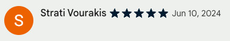

    

        <h1 class="landing-header">Tame Your Tabs</h1>
        <h3>
            Easily Save Tabs by Topic. 
            Then close them until needed.  
            No longer fear closing a tab!
        </h3>
    

    

        
    

    

        
    

    

        <h1 class="landing-header">Curate your Topics</h1>
        <h3>
            Organize and group your Topics however you wish. 
            Add Notes and TODOs
        </h3>
    

    

        <h1 class="landing-header">Control your Browser</h1>
        <h3>
            Switch between contexts with ease. 
            Keep your workspace distraction-free!
        </h3>
    

    

        
    

  

    
  

  

    <h1 class="landing-header" style="color: white !important; margin-top: 0px;">What the Press says:</h1>
    <h3 style="color: #D0FF4B; font-weight: 300;">...Gave bookmarks the performance and usability boost that I'd been waiting for all these years...it's a very nice, very fresh, take on bookmarks...I really like BrainTool. The rather simple interface might not be for everyone, but behind that simplicity is a lot of power.  ZDNET BUSINESS</h3>
  

  

    
    
Organize your tabs and bookmarks into a common set of Topics.

  

  

    
    
Quickly categorize, save and close tabs to unclutter your browser.

  

  

    
    
Incremental search and filtering makes it easy to find things again.

  

  

    
    
Organize and nest topics to add structure.

  

  

    
    
Add notes to any bookmark or webpage for future reference.

  

  

    
    
Use the Topic Manager to open and close individual tabs or multiple tabs by topic.

  

  

    
    
Customize topics with colors and icons.

  

  

    
    
Mark bookmarks and tabs as tasks with TODO functionality.

  

  

    
    
Keyboard shortcuts and support for power users.

  

  

    
    
Intuitive drag and drop from the browser bar into and within the Topic Manager.

  

  

    
    
Fully configureable display including density, font size and darkmode.

  

  

    
    
Free forever at any scale, optional premium features lock after 30 days.

  

  <h2 style="color: white; margin-top: 10px; margin-left: 50px;">What Our Users Say:</h2>
  

    

      

        

            
            

                Alice Free
                
            

        

        
It truly feels like the developers KNOW my brain. I checked off every bullet point on my list of needs and then some. I don't know how I ever lived without it.

      

      

        

            
            

                Evan Smith
                
            

        

        
I've tried other options, but BrainTool far surpasses them. It integrates seamlessly with my workflow, especially with organizing my research links and bookmarks, which is a game-changer for me.

      

      

        

            
            

                Strati Vourakie
                
            

        

        
The 1.0 update is phenomenal. Looks absolutely gorgeous, very visually pleasing & appealing, and a significant upgrade.

      

      

        

            
            

                Boisjere Kayasta
                
            

        

        
MANAGES WHAT MATTERS: Most tab, session or bookmark managers miss what really matters. The point is to manage the *meaning*, not just the identity of the target.

      

      

        

            
            

                Kapil Bhalla
                
            

        

        
Amazingly well thought out tool that makes my browser life so streamlined.

      

      

        

            
            

                Eliot Baker
                
            

        

        
Impressed with what BrainTool can do! The concept is brilliant, integrating bookmarks and tabs seamlessly with emacs org-mode notes fits into my workflow perfectly.

      

      

        

            
            

                Wade Fogarty
                
            

        

        
Everything is categorized and notated so I don't have to keep all the tabs open to keep track of all the crazy stuff I'm doing. Great extension!

      

      

        

            
            

                Ronna Bruce
                
            

        

        
I frequently need to open the same four websites, and this tool allows me to open them all at once or individually, which is fantastic!

      

      

        

            
            

                Ching Yeow Pang
                
            

        

        
BrainTool has helped me get my life organized in a way that I never thought possible.

      

      

        

            
            

                Adrian Boncan
                
            

        

        
5 stars for the amount of smart thinking that went into this, for the vision...it's a brilliant tab manager and you can use it to save content to hierarchies (topic maps) that work for you.

      

      

        

            
            

                Stefanos Kalantzis
                
            

        

        
it's a life saver, and a game changer for productivity and digital well-being...I especially love this project's Philosophy

      

      

        

            
            

                tsuki
                
            

        

        
Long time, I had trouble with bookmarks. But BT released me from confusion. I got back happy web surfing. Thank you very much!

      

      

        

            
            

                Jorge Bracer
                
            

        

        
having tried almost every other tab management extension I could find, this is the one that I finally believe is on the right track.

      

      

        

            
            

                Solaire Phantom
                
            

        

        
This extension naturally fits the bill of organizing such tab groups into a logical hierarchy of "work units" that can be quickly accessed / switched to.

      

      

        

            
            

                Joel Roberts
                
            

        

        
the tool itself is amazing...use this with TabFS, todoist.el, and rclone to do some pretty neat things. Very elegant.

      

      

        

            
            

                Jeff Russell
                
            

        

        
I've been using Braintool for several months now and I've been thrilled with it...The really great thing in BrainTool is the ability to save notes along with the link...The keyboard shortcuts also make it incredibly quick and easy to use

      

      

        

            
            

                Richard Llyod
                
            

        

        
This extension has me hooked as it's definitely not like your normal bookmark manager...The ability to use an org file to sycn was a genius move.

      

      

        

            
            

                George Craioveanu
                
            

        

        
This is becoming a powerhouse productivity tool! It is Bookmarks+Sessions+Outliner in one place...also, the whole idea of basing this on an org file is just brilliant!

      

      

        

            
            

                Trevor Lewis
                
            

        

        
I've used Session Buddy and OneTab. This is far superior...8 months later BrainTool absolutely still deserves 5 stars

      

      

        

            
            

                Krish
                
            

        

        
the reason I am leaving 5 stars is because of tagging, categorization, and notes taking that is clean and visible.

      

      

        

            
            

                M Schupan
                
            

        

        
look beyond the surface of BrainTool to discover it's hidden powers ... which are desperately needed in today's cloud-based environments where lots of information is hidden in the fog.

      

      

        

            
            

                CSW MVP
                
            

        

        
For a long time I was looking for a Tabs Outliner replacement because it is not actively developed. With Braintool I have found it.

      

      

        

            
            

                Carina Bracer
                
            

        

        
My husband recommended this extension as I stopped using Tabs Outliner

      

      

        

            
            

                Jonathan Bauer
                
            

        

        
As a current Tabs Outliner user, my first reaction is that BrainTool, even in its pre-1.0 release, is far more polished.

      

      

        

            
            

                Michael Diamond
                
            

        

        
Amazing App. I love that it's in plain text and uses org mode!

      

    

  
  

  <svg xmlns="http://www.w3.org/2000/svg" width="24" height="24" viewBox="0 0 24 24" fill="none" stroke="currentColor" stroke-width="2" stroke-linecap="round" stroke-linejoin="round"><polyline points="6 7 11 12 6 17"></polyline><polyline points="13 7 18 12 13 17"></polyline></svg>
  

  

    
    
Your data is kept in plain text in a private continuously synced and versioned text file.

  

  

    
    
No lock-in!  BrainTool uses structured org-mode syntax compatible with other productivity tools.

  

  

    
    
The file can be separately edited, used across devices with import and export to/from multiple sources.

  

  

    
    
BrainTool is open source. You can see what its doing!

  

