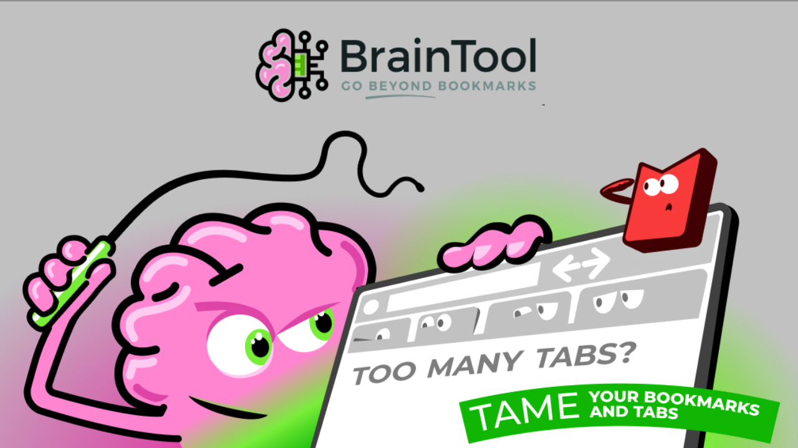
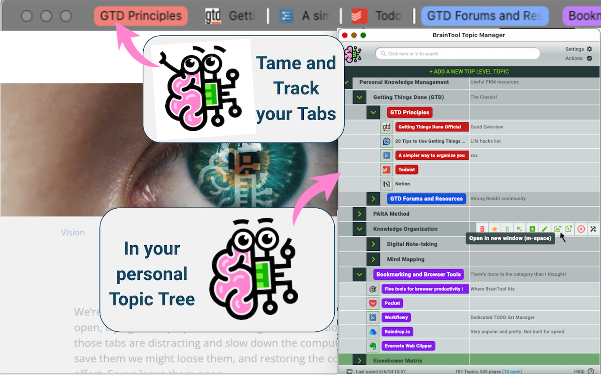
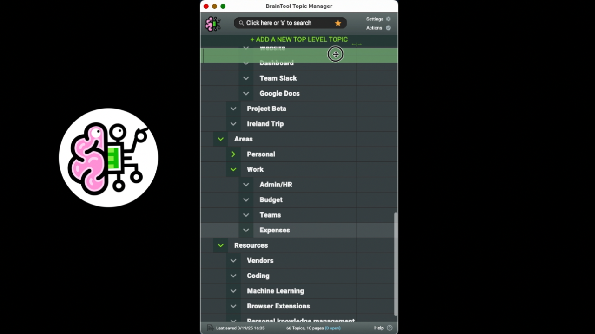
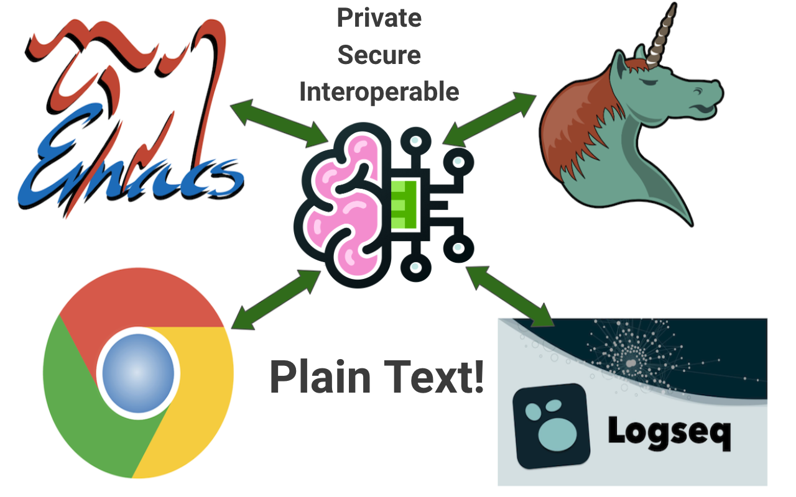
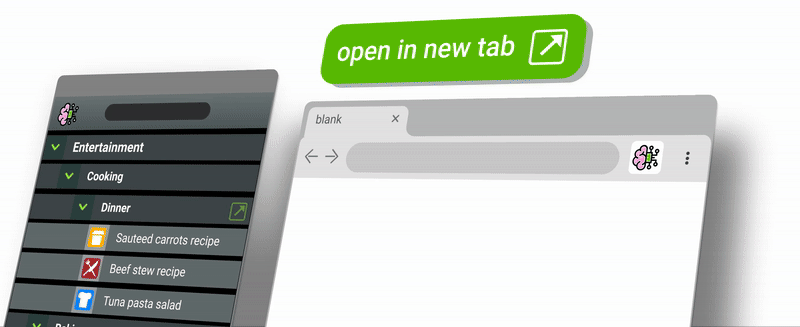
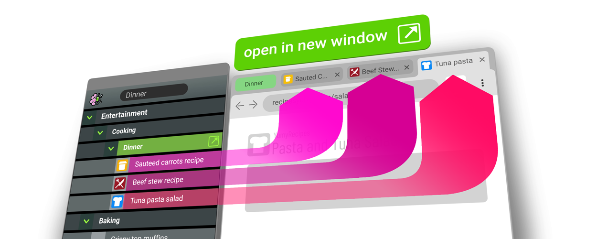
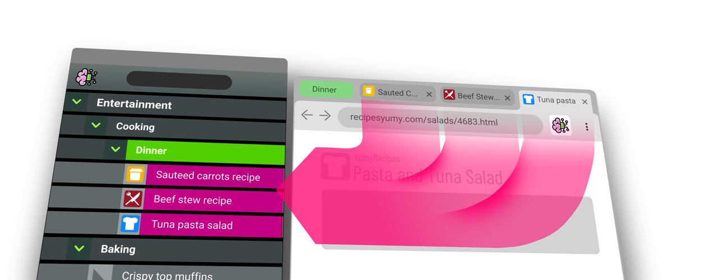
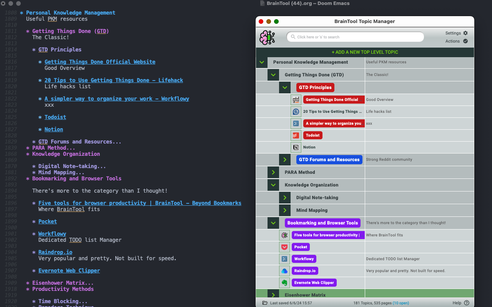
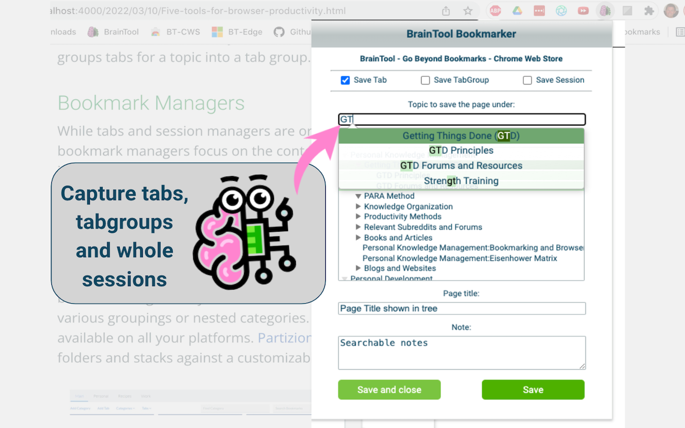

# BrainTool Content Resources
Feel free to re-use, re-purpose or modify any of the following resources to create content related to BrainTool.

## Overview Videos

  
 <!-- Left item -->
    
    BrainTool 40 Second Overview.
  

  
 <!-- Right item -->
    
    BrainTool Two Minute Ad.
  

## Feature/Demo Videos

  

    
    BrainTool Tabs and Topics.
  

  

    
    BrainTool Drag and Drop.
  

[Playlist of short demos](https://www.youtube.com/playlist?list=PLhaw8BE1kin3QoDaTxVXhO406kswXYlLF&si=Qw1xJlh4oEdMQisi)

## Older Video Material
Other videos were recorded over the last four years as BT evolved and may not accurately reflect the current UI: 
[An older version general overview](https://www.youtube.com/watch?v=afZg6nuH7Ck)

  
 <!-- Left item -->
    
    Integration with other PKM Tools.
  

  
 <!-- Right item -->
     
    Search and Key Commands.
  

[See the full play list for more](https://www.youtube.com/playlist?list=PLhaw8BE1kin0CQFuDXrWsdC6Nzhyo9dix).

## Content Aggregation and LLM Prompts
[This file](./compressed_context.txt) has most of BrainTool.org's text content and can be used for LLM prompting. Here are a couple of pre-recorded prompts to give you the idea:
- ["Using the attached and extension store content, give me about 500 words on BrainTool, what it does and how its percieved."](https://g.co/gemini/share/ae3a536033e9)
- ["Using the attached content give me potential text for a blog post on a personal PKM-focused blog/feed describing BrainTool and how it can be used as part of a personal knowldege and productivity management system."](https://g.co/gemini/share/fc8fc45d4b69)

## Animated GIFs

  

      
    Control Your Browser.
  
 
  

      
    Curate Your Topics.
  

  

      
    Tame Your Tabs.
  

## Images

  

      
    Control Your Browser.
  
 
  

      
    Curate Your Topics.
  

  

      
    Tame Your Tabs.
  

  

      
    Plain Text, emacs.
  
 
  

      
    BrainTool Bookmarker.
  

  

       
    BrainTool Buddy.
  

## Other Resources
- See the [Blog](./posts.html) for deep dives and background
- See the [Discussion Group](https://groups.google.com/u/0/g/braintool-discussion) for user interactions
- The [ZDNet article](https://www.zdnet.com/article/every-google-chrome-user-should-try-this/) that started in all.
 

Email braintool.extension@gmail.com with questions or suggestions to improve the content.
