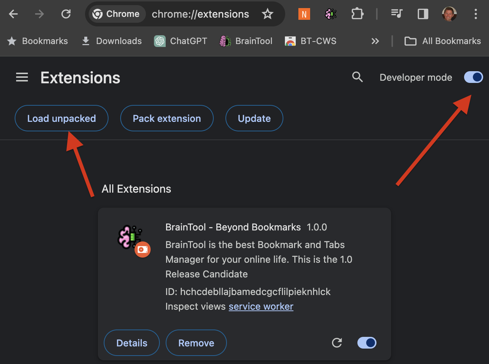

# Local Install
## Background
BrainTool is composed of two parts. The BT Extension that you downloaded from the App Store is code that's installed in the browsers extension system. It controls the BT icon in the toolbar and the Bookmarker popup window. It also listens for messages from the BT Topic Manager App and updates tabs accordingly and it sends back event notifications when tabs and windows open or change. On launch the popup code opens a browser tab to the braintool.org website. That tab displays the Topic Manager which is where the main logic of the application lives.

The contents of the extension, the app and the braintool.org website are stored in github. The extension components are bundled up for the latest version of BT and submitted to Google (or Microsoft for Edge) in order to be available on the App Store, everything else is generously hosted by github served up from the repository. 

## To Start
In order to run a version of BT other than the App Store version you need to enable Developer mode on your browsers extension page and load an 'unpacked' version of the extension. The extensions page is reached by opening a tab to chrome://extensions, edge://extensions, or brave://extensions based on your browser type.

## Caution!
Note that these instructions will install the BrainTool Release Candidate as a new extension. On your extensions page you can optionally turn off the 0.9.9 version of BT if you have it installed. Any previous BrainTool data or preferences will not be transferred. I recommend exporting and saving a copy of your BT data (Export under Actions) before installing the new extension. The export can be used to upload your data into the new extension after you install it if you wish.

If you sync your data to a GDrive or local file use caution and create backups to ensure you don't loose any data. GDrive syncing will use the same BrainTool.org file across browsers and extensions based on your Google account. Local file syncing can be pointed to the same file across versions but you can also create a new file, in a different folder.

## Run the Release Candidate via download
The easiest way to run the Release Candidate is to download the extension from this page and uncompress it into a local folder. Then click the 'Load unpacked' button on the extensions page and navigate to the folder. That will install the BrainTool 1.0 extension into your browser, you should see the Welcome page open and then be able to pin the BT 1.0 icon from the browser extensions panel.

[Download the extension file here](https://github.com/tconfrey/BrainTool/raw/master/versions/Release-Candidate/RCextension.zip)
## Run the Release Candidate from the repository
If you run [git](https://git-scm.com/) you can clone the BrainTool repo from [here](https://github.com/tconfrey/BrainTool). Then select the Braintool/versions/Release-Candidate/extension folder when you click the 'Load unpacked' button. Note that this scenario still loads the Topic Manager code from the braintool.org site (hosted by github) and will automatically get any changes pushed to the repo.

## Run any version of BrainTool from a local server
Clone the repo as above. The latest versions of the extension and app are under the top level /extension and /app folders, all other versions are under /versions , specifically the current App Store version is /versions/0.9.9  and the release candidate is /versions/Release-Candidate. 

You will need to edit the manifest.json and popup.js files in the extension folder of the version you want to run (probably versions/Release-Candidate/extension). In manifest.json change this row: 
`"matches": ["https://BrainTool.org/versions/Release-Candidate/*"],` 
to match the url from wherever you will run your server, eg: 
`"matches": [const url = "https://localhost:8000/versions/Release-Candidate/*"]` 
And in popup.js find the windowOpen function and edit the url constant from something like this: 
`const url = "https://BrainTool.org/versions/Release-Candidate/app/";` 
to something like this: 
`const url = "https://localhost:8000/versions/Release-Candidate/app/";` 

Install the unpacked extension as described above, run a local server from the top level BrainTool folder and launch the extension.
