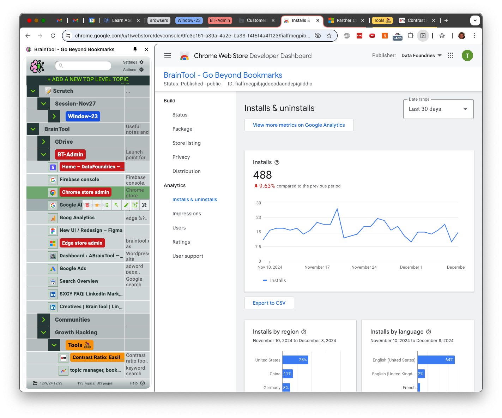
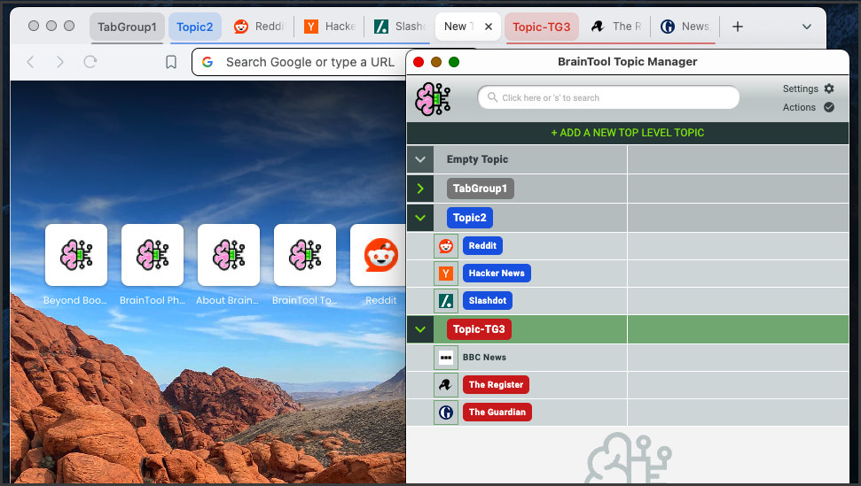
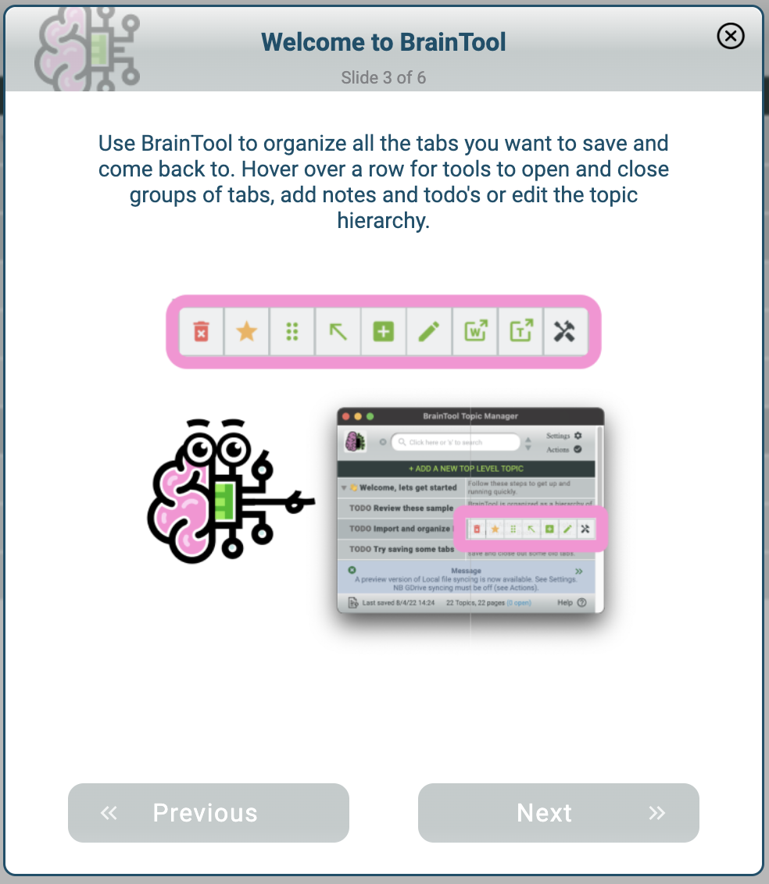

# BrainTool 1.2.2
New buttons inside the search box now allow you to filter rows to just show TODO's or just show the search matches.

# BrainTool 1.2
The notable change in 1.2 is the ability to run the Topic Manager in the browsers side panel. It kindof feels like BT has been pulled inside the browser!

Look for it under Settings. Your options are now:
- On a browser **'Tab'**. Perhaps a good option if you're annotating and organizing stuff inside the Topic Manager itself.
- In the new browser **'Side Panel'**. Middle ground, maybe ideal? Best if you're working within a single window across tab groups/topics.
- In the original 'side panel' **'Window'**. A separate window from which you can see and control all the action across other browser windows and tab groups, as well as all your topics in the topic tree. I called the BrainTool window the 'side panel' before Google added theirs, so its confusing!

# BrainTool 1.1
The major change in 1.1 is the addition of automatic local file backups. Other minor improvements include:
- Improved scrolling and arrow key support for search and row navigation.
- Defaulted and removed settings for Sticky tabs and Tab Groups.
- Removed Notes setting - just use the column resizer!
- Improved discoverability of Supporter purchase buttons.
- Added an uninstall feedback survey.
- bug fixes, performance improvements

# BrainTool 1.0.3
Minor release addressing some bugs and UI feedback. 
- Improved handling of dragging tabs between tabgroups and windows.
- Added the ability to resize the columns
- Added 'w' as a keyboard command for 'open in new Window'.
- Improved handling of screen configuration changes.

# BrainTool 1.0.2
A small point release with unfinished business from 1.0 and updates based on 1.0 feedback 
## Feature Updates
- Added topic expansion on hover so folded topics can be dropped into (thanks @rocketman455 for the suggestion!)
- Improvements to the upgrade process to make it clearer whats happening.
- Added trial expiration and initial nagging 30 days after installation.
- GitHub #32: When TopicMgr is in a tab - don't navigate on item deletion. If the browser is maximized don't adjust its position on first opening TM. 

## Fixes
- Better handling for gdrive cert expiry on save when Google Authorization popup is blocked.
- GutHub #33: Fixed regex to not clobber org properties.
- Improvements to tracking sticky tabs.
- Various refactoring and error handling housekeeping.

# BrainTool 1.0 
Welcome to the 1.0 version of BrainTool! We hope you find it to be a step closer to your ideal tool. Let us know what you think, directly (braintool-extension@gmail) or in the [discussion group](https://groups.google.com/u/0/g/braintool-discussion). See below for a list of changes. The timing of this release was forced by a Google deadline, so there's more to come soon! 

## Manifest V3
This change is not of great interest to a BT user but is mandated by Google (see this [notice](https://developer.chrome.com/blog/resuming-the-transition-to-mv3)) and required non-trivial code changes.

## Full Tab Group Support
One advantage of the manifest update is that it provides access to the tabgroup api so that BT can provide full synchronization between Topics and browser tabgroups. By default Topics are now shown as tabgroups in the browser. Tabs opened from BT open in a tabgroup labelled with the appropriate Topic. In the Topic Manager open links and Topics are highlighted with the tabgroups color. Changing the tabgroups color in the browser is reflected in the Topic Manager. Name changes and expand/collapse operations are also synced. 

Additionally dragging a tab into a tabgroup will save that tab into the Topic in BT. Dragging a saved tab out of its tabgroup will remove it from BrainTool. 

## Sticky Tabs
When 'Sticky Tabs' is enabled the relationship between a tab and an associated saved item in the Topic Manager is maintained when you click a link in the saved tab or during a server side redirection. This allows you to navigate around a saved site or app, or get redirected to a different url (for example to a log-in page) while staying in the context of the original saved BT Item.

## Topic Tree visuals 
As you can see from the screenshot, the expand/collapse buttons and the favicon displays have been restyled, and an empty topic is now visually distinct. It is hoped that these changes make the tree structure easier to see, in addition to improving the styling in general.

## Session saving and Bookmarker Updates
The BT Bookmarker now has the option to save a whole tabgroup (if the current tab is in one), and a complete session, in addition to the previous window and tab options. When saving a session, tab groups are saved as the corresponding BrainTool Topic. Any ungrouped tabs are put in a tabgroup named with a Window-N prefix and saved under a Topic with the same name in the Topic Manager. The Session itself is given a Session-date Topic name and saved under the Topic selected in the Bookmarker or the Scratch default Topic.

## Preferences for Dense, Hide Notes, Tooltips and Large Font
New preferences have been added for these items. 

## New Introductory Screens

We've added a helpful BrainTool Buddy to give a gentle introduction to BT when it's initially installed and at launch thereafter, until turned off on the final screen.

## GDrive Auth Change
Another Google mandated update is the change to use their [Auth 2.0](https://developers.google.com/identity/oauth2/web/guides/migration-to-gis) libraries for Google Drive authorization. Unfortunately the access provided to browser-based apps (ie those without a back-end server) is considered to be temporary access and to require explicit user interaction. If you have GDrive saving turned on you'll be warned in the red warning banner when the token expires. You can click to immediately re-auth or ignore it and re-auth will happen on the next save. From my perspective the change makes GDrive syncing less appealing but I'm interested in feedback.

## Usability Improvements
- Rows in the Topic Manager can now be dragged by selecting anywhere on the row
- The Tab key now iterates a selected Topic through three states: collapsed, open with its child nodes showing and open with its children all fully expanded.
- Search has been improved to make it easier to see the current match and other visible matches.

## Pricing and License Changes
I'd appreciate feedback on these planned changes:
- There will be no limits on numbers of nodes saved in BT (other than those due to browser storage limits)
- In addition to monthly and yearly subscriptions a one-time purchase lifetime license will be offered with pricing as follows:
  - Monthly $1.33/mo, Yearly $10.66/yr, Lifetime $21
  - This (low, low) pricing reflects my goal of having BT be widely used and to encourage users to support its development. The extra change over $1/$10/$20 covers the Stripe transaction costs.
- License enforcement will be as follows:
  - 30 days all access.
  - After 30 days messages of gentle encouragement will be shown at intervals.
  - Functionally some setting preferences will be locked (Dark mode, Favicons etc) but otherwise the app will be fully functional.

# Welcome to 0.9.9a
This is a minor point release because there are no changes requiring updates on the Web Stores, but it has some major functionality! In addition to releasing some ongoing UI improvements my goal with 099a is to get feedback on the beta version of local file syncing. I have not been able to test this functionality across a wide set of environments so I'm considering it in beta and encouraging anyone interested to give it a try and let me know (via the [discussion group](https://groups.google.com/u/0/g/braintool-discussion) ) if you have any feedback (positive or negative).

## Local File Sync
Local file sync opens up a lot of potential for saving, versioning and backing up your BrainTool data. The file location used by BrainTool can be hooked up to DropBox, a git repository or any other cloud syncing mechanism.

Local sync is mutually exclusive with GDrive syncing, you can only sync to one place. Syncing can be turned on via the Settings screen (click the new Settings icon, top right). If you are already syncing to GDrive and want to change you will first need to turn off GDrive syncing (via 'Actions', again top right). On initiation you will be asked to select a folder for BT to access. The browser will ask you to grant permission first for Read-only access to the folder and then for read-write access.

The ability to write to a local file from a web app is a newish capability and heavily secured within the browser. Every time you re-open the BT Topic Manager you will need to re-grant permissions for BT to write to the local folder. Note that the **Brave** browser developers have chosen not to implement local file access and so this feature cannot be made available on Brave.

## Settings, Actions and Help panels
The previous overlay panel put access to settings behind multiple mouse clicks and was confusing for many users. We've broken out those functions into separate panels which can be accessed directly from the top level Topic Manager. Settings and Actions are top right, Help is bottom right. Other than Local file sync, the available settings and actions are unchanged.

## Tips, Messages and Warnings 
A colored panel below the topic tree now shows any required informational messages on startup and subsequently provides access to a set of tips on BT usage. If a sync file is out of date the panel shows a 'Warning' message and provides a shortcut to the refresh function with a single click.

## Minor UI changes
In addition to the above:
- Some colors have been tweaked to improve contrast and readability.
- The application as a whole now does a better job of handling wide and narrow Topic Manager windows.
- The topic card editor makes better use of space and use a fixed width font to improve org-mode compatibility.

## Telemetry 
While your privacy is a key aspect of the BrainTool value proposition and we do not have any access to your data, we do need to collect some information on how the application itself is being used. On startup the app now records (to Google Analytics) the number of saved topics and pages, the number of file saves/updates, the number of tab operations performed, the number of times you've launched the app, days since install and how long your last session of using it was.

# BrainTool 0.9.9

Inching closer to 1.0! I'm getting such great feedback from users that I can't resist the temptation to incorporate the improvements before closing on 1.0. See [Pricing](../pricing.md) for a special offer for pre-1.0 subscribers.

## New Look and Feel including a Dark Mode
I completely revamped the BT fonts and color palette and added a dark mode - the most requested feature.

## Re-organized Saver Tool
I made another iteration on whats been called the bookmarker or popup to make it easier to understand while keeping it fast and efficient for both mouse and keyboard users. Additionally, any number of nested new topics can now be created from the Saver e.g. setting the topic to Animal:Vertebrate:Mammal:Carnivore:Canid:Dog:Hound:Beagle will create 8 levels of topic if they don't already exist.

## Compact Mode
Another highly requested feature. Shrinking the Topic Manager to less than 350 pixels wide hides the notes column for a highly compact and information dense display of your saved topics and pages.

## "Open in New Window" Tool
You can now open a page, or complete topic, in a new window. The previous mapping of topics to windows has been removed as being too complicated. You can choose to have BT manage your tabs, grouping them into tab groups, or not, thus leaving them wherever you or the browser puts them. BT will no longer confuse you by moving tabs between windows.

## "Add Top Level Topic" Tool
Available at the top of the Topic Manager. Hopefully this one is self-explanatory.

## Topic Manager window remembers its position
The Topic Manager now opens with the same size and position as it had when it was last closed.

## GDrive Refresh Button
If you have GDrive syncing turned on, the Refresh button is now available in the top toolbar whenever BT detects that there is a newer file available.

## Topic Tree imports
A correctly formatted org-mode file will now import its contents into the appropriate nesting in the tree. See [these topic trees](../topicTrees) as an example.

## Other Usability and Misc Improvements
I removed the counter for number of saves (top right) because its no longer part of the [pricing model](../pricing). Lots of improvements were made in areas like the card editor, the initial topic tree, the initial placement of the topic manager etc.

# BrainTool 0.9.8
## New Bookmarker 
To address some confusion and to make the 'popup' more usable I've re-designed it from the ground up and done some rebranding. I'm now calling the popup 'Bookmarker'. Clicking the BT icon (or Opt/alt-b) now opens the Bookmarker showing the note card for the page with the Notes field selected. You can still just hit enter to move on without adding a note, for speed. This new card editor also allows you to edit the page title and it's where you can select to save all tabs or just the active one.

On exit the card editor opens the topic selector. This was also reworked to show a clearer view of your topic hierarchy. The hierarchy starts partially open and subtopics can be opened, closed and selected with your mouse. Auto complete works as before, just start typing. The previous 'Group', 'Stick', 'Close' options have been reduced to a selector for 'Group' or 'Close'. The selector remembers its start and defaults to that the next time around.

## Skip the Topic!
By popular demand I added a 'Scratch' topic. If you leave the topic selector empty the page (or pages) will be added under the Scratch topic. This means you can save a page, or all pages in the window, by bringing up the Bookmarker and hitting Enter twice, the first creates the note card with an empty note, the second saves the page under Scratch.

## Update existing note cards in the Bookmarker
With this new bookmarker design I was able to add the ability to edit the notes and title for existing saved pages. Opening the Bookmarker for a page already saved to BT will open it's note card and save any updates. (NB changing its topic still needs to be done in the Topic Manager.)

## Side Panel is now Topic Manager and can run in a tab
The term 'Side Panel' did not make sense to folks so its been renamed to Topic Manager. Based on a suggestion from Crimson K and validation from Timothy, I added an option for the Topic Manager to run in a browser tab rather than the current side panel. Its not optimized for this form factor and for me it works better as a panel off to the side of my browser tabs but it seemed worth adding to support a full-page-on-top type setup. From Options, change 'Topic Manager in:' from 'Side Panel' to 'Tab', wait a few seconds for it to save, then close the Topic Manager. When you relaunch, the Topic Manager will open in a regular browser tab. If you use it in this mode I'd be interested in feedback over in the discussion group.

## Performance Improvements
Thanks to Timothy for stressing BT with his six thousand plus bookmarks! A small tweak to avoid a low level recalculation of layout for every table row added resulted in a significant speed up on first start with a big braintool.org file. Search got similar performance attention and should now be snappier.

## Search Improvements
Thanks to Peter for his detailed feedback on Search. Improvements include better key handling on Linux, being able to 'escape' key out of search, restoring previous selection on failed search and a few other bug fixes.

## Space key
Also based on Peter's feedback, the space key will now open a tab for the selected item if its not already open, and highlight it if it is open.

## BT Icon State
Thanks to feedback from Richard, the BT toolbar icon now properly indicates when the Topic Manager is closed and thus BT is not operational.

# BrainTool 0.9.7
## Search
Yay! I added the incremental search I've wanted for a long time. See the new [User Guide](./userGuide) for details, or just try playing with it and let me know what you think. There's also a [brief demo](https://www.youtube.com/watch?v=TVaIQHoxxZU) on YouTube.

## Best effort mapping of open tabs to saved links on startup
When you first launch BrainTool it will attempt to find any tabs which you have already saved into your braintool.org file and show them as open in the tree. Note that since some web sites do an invisible redirect, which changes the URL, some matches may not be shown.

## Selection in tree now tracks highlighted tab in browser
As you navigate tabs in the browser any matching row in the BT tree will be selected (and scrolled into view).

## Minor onboarding updates and usability updates
- I trimmed the initial BrainTool.org file contents to be less overwhelming.
- The initial first-click popup now explains the side panel and popup.
- When the side panel is closed the popup icon now shows an indication that BT is not running.

## Bug fixes 
- BT now saves correctly on keyboard number based folding and keyboard row moves. 
- Topic nodes with no links are now placed correctly in the hierarchy. 
- (BTW Thanks to Richard for detailed bug reports on these two issues.)
- Better handling of Google Drive versioning should remove spurious warnings about a newer file version existing. These were caused by the 0.9.6 feature that warns if the synced GDrive file has been changed external to BT.
- Tab navigation now works correctly on the topic card editor.

## [New User Guide](./userGuide)
Its a first pass I'd appreciate feedback.

# BrainTool 0.9.6

## Cleaner more minimal UI
Based on the results of a comprehensive review by a panel of designers and UX folks I've moved to a cleaner more minimal UI with bigger buttons, more spacing and clearer backgrounds. 
## Improved onboarding process
Combined with the general UI improvements I overhauled the installation and getting started process to try to address areas where new users were getting confused and to get them up and running with less effort.
## Support for Edge and Brave browsers
Edge users can get BrainTool at the Edge store. Brave users can install from the Chrome store. Unfortunately Firefox does not support the tab groups function BT needs and has other incompatibilities that made it too onorous for me to support it in this release. Vivaldi (installable via the Chrome store) works with Topic mapping set to 'Windows'.
## Added support for subscription memberships and coupons
In advance of the 1.0 version of BrainTool I needed to put some structure in place to allow me to charge for premium subscriptions. See the in-app coupon offer!
## Version warnings for synced Google Drive file
If you've chosen to sync to a Drive file BrainTool now checks before saving, and on getting focus, whether there's a more recent version than the one you are viewing and if so provides an alert (if saving) or warning.

# BrainTool 0.9.1a
This is a minor update with some Side Panel improvements (no change to the core extension). The header row now shows GDrive connected state and, on hover, the latest save time. The Edit Card popup has been cleaned up quite a bit and now allows tabbing through fields and navigation to next/previous cards with Alt/Option arrow keys. Other popups were tweaked for consistency. Finally, the 'Refresh from Gdrive' button has been moved inside the Options panel.

See below for release notes from 0.9.0 and previous versions. 

# BrainTool 0.9.1
Org mode import fixes.

# BrainTool 0.9.0
## File Import/Export
In addition to Bookmarks, 0.9 adds the ability to import from a TabsOutliner export and also to import a text file with org-mode markup. Heading, paragraph text and contained http(s) links are extracted and represented in the tree.

In addition to exporting to Bookmarks you can now also export an org file.

## org-mode Support
This version upgrades to version 2 of the very handy [orga.js](https://github.com/orgapp/orgajs) org parser by [@xiaoxinghu](https://github.com/orgapp/orgajs/commits?author=xiaoxinghu). BrainTool should now retain any org markup in the BrainTool.org file (or an imported file). BT stores app data using headers for Topics, headers with links for topic occurrences (ie links) and paragraph text for notes. Other constructs such as lists, tables, blocks etc will just be shown in plain text in the tree and written back out as such.

The idea here is to allow BrainTool to become an integral part of a text and org-based note taking and productivity workflow.

## Removed GDrive Dependency
The need to perform the GDrive permission workflow on the initial install made the whole thing overly complicated for people. With the new ability to upload and download the file manually I decided to decouple the GDrive permissions.

By default BT now stores your data in browser local storage. This should be resilient across browser sessions on a single Chrome instance. Its still advisable to also write to the BrainTool.org file on your GDrive but not necessary. If you currently have the GDrive app connected you can disconnect it from Settings on the [GDrive web page](https://drive.google.com).

## Other Minor Improvements
 * New Keyboard commands - entering 1 through 9 now collapses the tree to the numbered level (e.g. hit '2' to show just the top two levels of the tree)
 * URLS of the form file:/// are now supported, type something like file:///users/tconfrey/Documents/ into Chrome's address bar and save it into your BT tree! 
 * Tree folding and unfolding now has a slight animation to help maintain your bearings.
 * The popup now has some descriptive hover text and an explicit 'Save' button which does the same thing as just hitting Enter in the Notes field.

# BrainTool 0.8.1

This BrainTool point release has a few changes you might notice:
  - Improvements to navigation with the right and left arrow functions to open and close nodes while navigating the tree.
  - Showing the topic's full parentage in the topic editor popup.
  - Better pre-fills for the topic to use in the popup.
  - Improvements to keeping tabs assigned to tab groups properly during navigation.
Thanks to Richard and Matti for their bug reports, suggestions and feedback on the above.

# BrainTool 0.8.0

## Support for Release Notes!
Hopefully you are seeing this page as a result of being upgraded to the new version of BrainTool. I also added a [Welcome](welcome.md) page for new installs, feel free to check it out. See also the general [Support](../support.md) page.

## Keyboard shortcuts
To support keyboard commands I've added the notion of having an explicitly selected row. Clicking a row selects it (also navigating Next or Previous selects the first or last row). The selected row is shown in dark green and the selection-specific shortcuts operate on it. 

Key bindings were influenced by emacs/org-mode but given that the browser absorbs lots of control characters (Ctrl-N, P, S etc) and that only a small subset of BrainTool users are emacs/org natives, I defaulted to skipping the Control key. Commands operating on the selection are as follows:
  - Tree Navigation/Display:
    - <b>n, p or up/down arrow keys</b> select the 'n'ext or 'p'revious row.
    - <b>left arrow</b> collapse the selection, if expanded, then navigates up the tree to the selections parent Topic.
    - <b>right arrow</b> expand the selection, if collapsed, then navigates down the tree to the selections children.
    - <b>Tab</b> expands or collapses the subtree for a Topic row.
  - Browser Control:
    - <b>Space</b> surfaces the selections' tab or window if it's open in the browser. (NB you also get this by double clicking a row.)
    - <b>Enter</b> toggles open/close the selected links tab in the browser, or all of its tabs if its a Topic.
  - Tree Editing:
    - <b>Opt-up/down arrows</b> move the selection up/down.
    - <b>t</b> cycles the TODO state.
    - <b>e</b> opens the editor for the selection.
    - <b>Opt-left arrow</b> outdents (promotes) the selection.
    - <b>delete</b> deletes the selected topic or occurrence.
    - <b>Opt-enter</b> creates a new child Topic.

In addition there are the following general keys:
  - <b>h</b> Keyboard commands can be shown any time by typing 'h'.
  - <b>Opt-z</b> undoes the last deletion. (Only one level for now.) Note that previous versions of your BrainTool file are saved by Google on your GDrive.
  - <b>Opt-b</b> opens the BrainTool popup on the current browser tab.
  - <b>Opt-b-b</b> opens and selects the BrainTool side panel.

## Ability to tag all a windows tabs at once
See the checkbox on the BT popup.

## Stats Bar
I reworked the Options menu to be static at the top of the screen and added a stats bar showing you how big your braintool is.

# BrainTool 0.7
In addition here's what happened in 0.7.

- New grouping options were introduced. 
    - Window, as before one window per Topic. 
    - Tab Group - a tab group per Topic. 
    - None - no active grouping, tabs are created in place.
- NB the TabGroup api is not fully supported in the production version of Chrome so tab group names are not synced with Topic names.
- New Topic insert button. Add a sub topic under any topic.
- Support for topics with no links to occurrences.
- Updated icons. 
- The BT toolbar badge scrolls to show full tag name and shows notes on hover and in the popup (read-only).
- double-tap option-b to surface BT window
